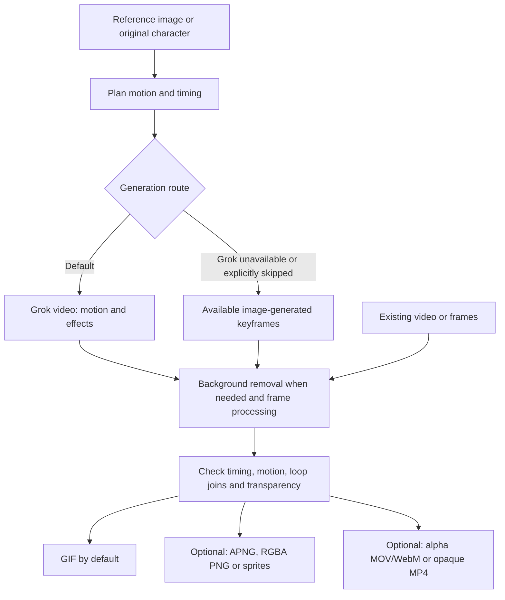

# Video GIF Studio

**English** | [繁體中文](README.zh-TW.md)

## Examples

**Seated leg switch** — Reference image → Grok video → transparent GIF.

[GIF](examples/seated-leg-switch/final.gif) · [Reference, prompt and production record](examples/seated-leg-switch/README.md)

**Original robot wave** — Created without a reference image.

[GIF](examples/robot-wave-no-reference/final.gif) · [Production record](examples/robot-wave-no-reference/README.md)

**Chibi dash attack** — Running steps, sword trails and recovery. Full-speed loop review remains pending.

[GIF](examples/chibi-running-dash/final.gif) · [APNG](examples/chibi-running-dash/final.apng) · [Sprite pack](examples/chibi-running-dash/sprites.zip) · [Production record](examples/chibi-running-dash/README.md)

**NEON ZEN** — 30-second music PV assembled from five Grok clips. Full-speed music sync review remains pending.

[MP4 with music](examples/neon-zen-pv/final.mp4) · [Story and production record](examples/neon-zen-pv/README.md)

## Main workflow

Codex coordinates the workflow. Available image tools create characters or explicitly requested repairs; use GPT-Image-2.5 when exposed by the environment. **Grok is the default for new motion and unspecified effects.** Preserve source frames, plausible anatomy, weight transfer and complete effect framing.

**Without Grok, GIF generation still works:** use available image-generated keyframes or existing media. Complex motion may need a video provider. See [fallback options](references/fallback.md).

**Why Grok:** Grok is the default to achieve natural animation with strong motion continuity. Codex then processes the frames, checks the result and exports it. Results still need review; GIF generation also works without Grok.

## Installation

Give this request to your AI assistant:

> Install the Codex skill from https://github.com/miles990/video-gif-studio. Follow references/install.md, preserve existing data, install dependencies and run the doctor check. Report local tools and Grok readiness separately.

See [installation instructions](references/install.md). Then invoke `$video-gif-studio` in Codex.

## Requirements

- **Codex**, plus an available image-generation tool when creating character images or keyframes.
- **Grok** — default but optional. Sign in to [Grok Imagine](https://grok.com/imagine) to generate video on the website, then import the downloaded video; no API key or CLI is needed for website use. Account access and limits apply. The bundled automatic client uses separate CLI OAuth or API-key authentication. [Connection setup](references/grok.md).
- **Python 3.11+** — the installer manages Python packages and missing FFmpeg/ffprobe on supported platforms. [Dependencies](references/dependencies.md).

## Usage

Describe what you want; let the skill choose the script, motion, duration, camera, effects and export settings based on your intended use. Defaults are Grok generation and GIF output. It asks only for essential missing information or additional spending authorization.

> Use $video-gif-studio to create a character animation. Decide the script, motion, duration, camera, effects and output format for me.

> Use $video-gif-studio to create a transparent character GIF from this image, with natural motion and a seamless loop.

> Use $video-gif-studio to create an original chibi swordswoman performing a dash attack with elaborate sword effects. Export APNG and a sprite sheet.

| Option | Choices |
| --- | --- |
| Input | Reference image, original character, existing video or frames |
| Background | Auto (default), preserve artwork, explicitly requested AI repair |
| Output | **GIF (default)**, APNG, PNG frames, sprite sheets, MOV, WebM, MP4 |
| Editing | Trim, reorder, retime, timed stills, timed loops, music and beat alignment |
| Continuation | Selected keyframes, last frame + consistency references, or last frame only; subject to provider support |

**GIF has binary transparency.** Use RGBA PNG/APNG for soft edges and fading effects, or alpha-capable MOV/WebM. **MP4 is opaque.** Game assets favor PNG frames and sprite sheets; pixel art preserves its logical grid and nearest-neighbor scaling.

### Special use: continuously extend a video

**In principle, repeated generation and stitching can keep extending a video without a fixed total-duration ceiling.** Use the last frame and suitable consistency references to generate the next segment, review the join, then append and repeat. This uses multiple generation requests, not one unlimited-length request.

Each task needs a target duration, segment count or budget. Actual length is constrained by quota, cost, compute/storage and accumulated continuity drift. Codex coordinates the process; automatic chain execution and multi-reference/edit/extend CLI modes are not bundled. See [continuation workflow](references/chain.md).

Details: [Skill](SKILL.md) · [Transparency](references/transparency.md) · [Pixel art](references/pixel-art.md) · [Sprites](references/sprites.md) · [Video export](references/video-export.md) · [Timeline](references/timeline.md) · [Music](references/music.md) · [Continuation](references/chain.md)

License: [MIT](LICENSE)
