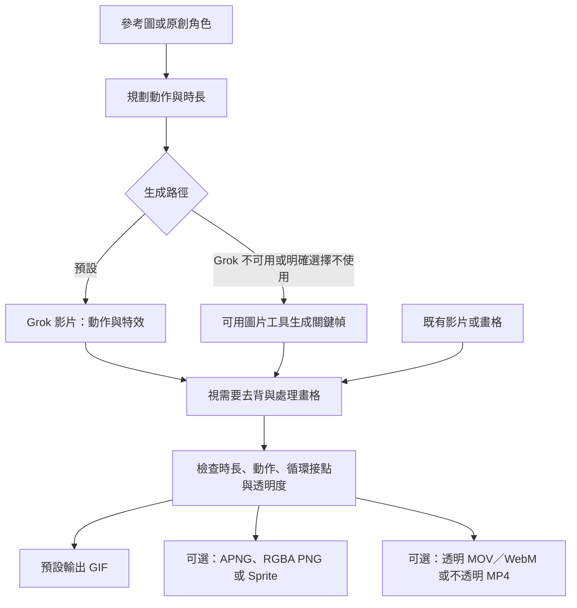

# Video GIF Studio

[English](README.md) | **繁體中文**

## 範例

**坐姿換腿** — 參考圖 → Grok 影片 → 透明 GIF。

[GIF](examples/seated-leg-switch/final.gif) · [參考圖、提示詞與製作紀錄](examples/seated-leg-switch/README.zh-TW.md)

**原創機器人揮手** — 不使用參考圖，從文字建立角色。

[GIF](examples/robot-wave-no-reference/final.gif) · [製作紀錄](examples/robot-wave-no-reference/README.zh-TW.md)

**Q 版前衝攻擊** — 小跑步、劍光與收招；正常速度下的循環驗收仍待完成。

[GIF](examples/chibi-running-dash/final.gif) · [APNG](examples/chibi-running-dash/final.apng) · [Sprite 素材包](examples/chibi-running-dash/sprites.zip) · [製作紀錄](examples/chibi-running-dash/README.zh-TW.md)

**NEON ZEN** — 五段 Grok 影片串接成 30 秒音樂 PV；完整播放的音樂同步驗收仍待完成。

[有聲 MP4](examples/neon-zen-pv/final.mp4) · [腳本與製作紀錄](examples/neon-zen-pv/README.zh-TW.md)

## 主要工作流

由 Codex 協調整體流程；可用圖片工具負責建立角色或明確要求的修復，環境提供 GPT-Image-2.5 時可使用。**新動作預設使用 Grok，未指定的特效也交由 Grok 生成。** 保留來源畫格、合理人體結構與重心轉移，特效完整入鏡。

**沒有 Grok 也能生成 GIF：**使用可用圖片工具生成關鍵幀，或處理既有素材；複雜動作可能需要影片服務。詳見[替代流程](references/fallback.md)。

**為什麼這樣做：**連續影片保留獨立姿勢圖容易缺少的中間動作；直接處理來源畫格，減少反覆重繪造成的角色漂移。RGBA 主檔保留柔邊透明度，GIF 方便預覽與分享；沒有 Grok 時，仍可用關鍵幀完成簡單動畫。

## 安裝方法

把這段交給 AI 助理：

> 請安裝 https://github.com/miles990/video-gif-studio 的 Codex skill。依 references/install.md 操作，保留既有資料，安裝依賴並執行 doctor 驗證，分別回報本機工具與 Grok 是否就緒。

詳見[安裝說明](references/install.md)。安裝後在 Codex 使用 `$video-gif-studio`。

## 需求

- **Codex**；建立角色圖或關鍵幀時，另需可用圖片生成工具。
- **Grok** — 預設使用，但非必要依賴；此路徑需登入、影片權限與額度。[連線設定](references/grok.md)。
- **Python 3.11+** — 安裝器管理 Python 套件，並在支援平台下載缺少的 FFmpeg／ffprobe。[依賴說明](references/dependencies.md)。

## 使用方法

> 使用 $video-gif-studio，參考這張角色圖，製作動作自然、無縫循環的透明 GIF。

> 使用 $video-gif-studio，建立原創 Q 版女劍士，做帶有華麗劍光的前衝攻擊，輸出 APNG 與 Sprite Sheet。

| 選項 | 可選內容 |
| --- | --- |
| 輸入 | 參考圖、原創角色、既有影片或畫格 |
| 背景處理 | 自動（預設）、保留原畫、明確選擇 AI 修復 |
| 輸出 | **GIF（預設）**、APNG、PNG 畫格、Sprite Sheet、MOV、WebM、MP4 |
| 剪輯 | 裁切、排序、變速、定時靜止、定時循環、音樂與卡點 |
| 接續 | 合適關鍵幀、尾幀＋一致性參考圖、只有尾幀；依模型支援選用 |

**GIF 只能全透明或全不透明。** 柔邊與消散特效使用 RGBA PNG／APNG，或支援 Alpha 的 MOV／WebM；**MP4 不保留透明度**。遊戲素材優先使用 PNG 畫格與圖集；像素風保留原生像素格，採最近鄰縮放。

長影片由 Codex 協調多段生成，檢查接點後組合；自動 chain 執行器與多參考圖／影片編輯／延伸 CLI 模式尚未內建。

詳細說明：[Skill](SKILL.md) · [透明處理](references/transparency.md) · [像素風](references/pixel-art.md) · [Sprite](references/sprites.md) · [影片輸出](references/video-export.md) · [時間軸](references/timeline.md) · [音樂](references/music.md) · [接續生成](references/chain.md)

授權：[MIT](LICENSE)
