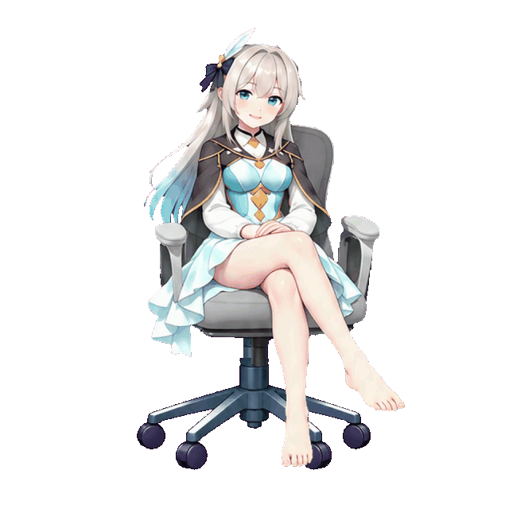
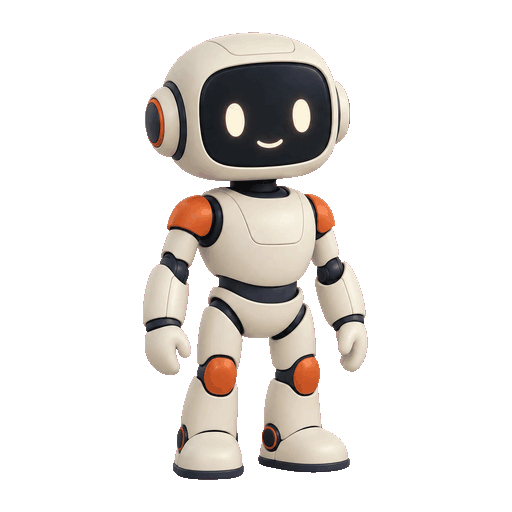
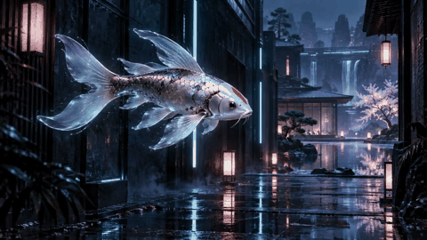

# Video GIF Studio

[English](README.md) | **繁體中文**

支援有／無參考圖的角色動畫製作 skill：由 **Codex** 協調角色製作、**Grok** 動作與特效生成、去背及透明動畫輸出。角色圖或明確選擇的修復可使用環境提供的圖片工具；**GPT-Image-2.5 可用時亦可使用**。預設保留影片的連續畫格。

授權：[MIT](LICENSE)

## 安裝方法

把下面這段交給 Codex 或其他具備本機操作能力的 AI：

> 請幫我安裝 https://github.com/miles990/video-gif-studio 的 Codex skill。請先讀取 references/install.md，完成 skill 註冊、Python 依賴安裝與 doctor 驗證；保留既有安裝和資料，並分別告知本機 GIF 工具與 Grok 影片生成是否就緒。

AI 安裝流程見 [references/install.md](references/install.md)。安裝後在 Codex 下一次對話回合使用 `$video-gif-studio`。

## 需求

- **Codex**：負責生成協調、動作時長、去背與輸出。建立角色或 AI 修復另需可用的圖片生成工具；環境明確提供 **GPT-Image-2.5** 時可使用，實際模型與 Alpha 輸出能力須確認。既有素材轉檔不需要圖片模型。
- **Grok**：已登入且具備影片生成權限與額度；repo 已內建影片提交、查詢與下載功能，OAuth 使用官方 Grok CLI 登入，也可明確選用不需 CLI 的 API key 模式，詳見 [Grok 使用方式](references/grok.md)。
- **本機環境**：Python 3.11 或以上、`requirements.txt` 套件，以及 FFmpeg／ffprobe。

已有影片或透明 PNG 畫格時，可直接轉檔，不必再次呼叫 Grok。

安裝器管理 Python 套件，並在缺少 FFmpeg／ffprobe 時下載支援平台的執行檔。可用 `--with-matting` 安裝本機 rembg 去背入口；逐幀遮罩仍需檢查閃爍，並非時序去背模型。Grok 可明確選用 `--auth api-key`，這條路徑不需要 Grok CLI；OAuth 登入仍使用官方 CLI。首次安裝／模型使用需要下載，雲端模型服務與帳號憑證仍為外部需求。詳見 [依賴管理與本機去背](references/dependencies.md)。

## 使用方法

製作流程：**參考圖或原創角色 → Grok 連續動作與所需特效 → 去背 → RGBA PNG 畫格、選用 APNG 與 GIF 預覽**。既有影片可從去背階段開始。未指定時，動作遵循合理人體結構、重心轉移與位移；人物、武器和特效至消散都須完整留在畫面內。要求無縫循環時須檢查實際接點。

**特效預設交由 Grok 處理。** 需要特效但未特別指定設計或生成來源時，由 Grok 在動作影片中自行設計並生成特效。Codex 負責規劃特效時機、物理因果、動作可讀性與完整構圖，再進行去背及輸出；使用者有明確指定時，則依指定內容製作。

提供參考圖：

> 使用 $video-gif-studio，參考這張人物圖，製作自然連續動作的透明 GIF。

不提供參考圖：

> 使用 $video-gif-studio，設計原創小機器人揮手，生成連續影片並製作透明 GIF。

調整既有影片：

> 使用 $video-gif-studio，把這段影片製成透明 GIF，調整動作速度並驗證輸出。

可選擇透明處理方式，未指定時使用「**自動處理**」：

| 模式 | 處理方式 |
| --- | --- |
| **自動處理（預設）** | 保留來源畫格，使用既有 Alpha、色鍵或可用的時序去背工具，不自動逐幀重繪。 |
| **保留原畫優先** | 優先保留角色像素與動作，無法乾淨分離的部分會明確標示。 |
| **AI 修復／重繪** | 明確選擇圖片模型修復，接受外觀可能變動，並重新檢查跨幀一致性。 |

這些是流程選擇，不是命令列參數。內建色鍵適用純色背景；可選用本機 rembg 入口產生逐幀遮罩，仍須檢查閃爍。時序去背模型尚未內建。更換檔案格式無法找回去背時已刪除的細節。

柔邊、髮絲、煙霧與消散特效應保留 **RGBA PNG／APNG** 主檔。**GIF 只能全透明或全不透明**，適合作為相容預覽。像素風也可以保留半透明；硬邊輪廓與透明光效應分別處理。

**未特別指定時，像素風依原生像素格處理：**保留色塊與階梯輪廓，使用整數倍最近鄰縮放，不以模糊或平滑掩蓋邊緣。特效有需要時仍保留半透明，不將所有 Alpha 二值化。詳見[像素風處理方式](references/pixel-art.md)。

可任選或組合 **GIF、APNG、RGBA PNG 逐格圖、Sprite Sheet、MOV、WebM、MP4、完整素材包**。輸出選項與上方的去背模式分開選擇。**未指定格式時預設 GIF**。也可選 MOV（ProRes 4444）或 WebM（VP9），輸出工具會驗證 Alpha；仍須確認目標播放器的透明支援。長影片任務應使用影片輸出，GIF 可作短段預覽，**MP4（H.264）不保留透明度**：透明區域會合成指定底色，預設黑色。詳見[影片輸出](references/video-export.md)。遊戲用途優先提供 PNG 畫格、圖集與資料。

內建 [sprite 輸出工具](references/sprites.md)可製作多頁 RGBA 圖集，記錄格位、每格時長與固定錨點，並可設定圖集大小、間距、整數縮小倍率與錨點。引擎匯入器、遊戲事件、碰撞框與 root motion 軌跡仍需另外實作。已合成影片不保證能可靠拆出角色與特效。

> 使用 $video-gif-studio，製作 Godot 用的角色攻擊動畫。保留原畫優先，保留半透明，輸出 PNG 畫格與 APNG 預覽，另輸出 Sprite Sheet 與時長資料；明確告知尚需哪些引擎整合步驟。

完整流程見 [SKILL.md](SKILL.md)，另見 [透明處理與交付選擇](references/transparency.md) 和 [輸出說明](references/export.md)。

### 輸入音樂與卡點剪輯

可輸入音樂，產生波形與可編輯的 BPM／拍點候選，再依重要節奏剪接已準備的動畫。內建支援**裁切、拆段／排序、變速或時長適配、拍點對齊、靜止與定時循環**，並輸出帶一條連續音樂的影片。MOV／WebM／MP4 可帶音訊；GIF／APNG／Sprite 不含聲音。

自動 BPM 是估計，不保證辨識到正確強拍。可指定 BPM／起始偏移或手動編輯拍點，再聆聽驗收。攻擊卡點應對齊實際發力事件，不能只把片尾放在拍點就宣稱整段動作對拍。此本機流程參考 lyrica-studio 將音樂分析與時間軸剪輯分開的做法，沒有依賴該專案，也不是完整圖形剪輯器或全自動 MV 生成器。

> 使用 $video-gif-studio，參考這首音樂與這些動畫，分析拍點，讓主要攻擊落在合適重拍，裁切並安排鏡頭，輸出含原音樂的 MP4。保留像素輪廓，附時長規劃與尚待驗收的同步項目。

詳見[音樂輸入、拍點與剪輯](references/music.md)。

### 靜止畫面與停留時長

可插入指定時長的圖片：**動畫 → 尾幀停留 2 秒 → 下一段動畫**，也可選另一張圖或下一段首幀。內建[時間軸組合工具](references/timeline.md)可串接已準備的畫格與精確停留時長，預設輸出 GIF，亦可選 APNG、Sprite、MOV、WebM 與不透明 MP4。完全靜止的停留不需要 Grok 重新生成。

靜止會連同特效一起暫停；呼吸、眨眼或繼續消散的粒子需要動畫片段。素材須使用相同畫布大小，工具不會為了對齊而拉伸或模糊像素畫。

> 使用 $video-gif-studio，讓這段動畫的尾幀停留 2 秒，再接下一段動畫，輸出 GIF 與白底 MP4。

也可設定**一段 loop 動畫播放多久**，例如「走路循環 5 秒 → 停留 1 秒 → 攻擊」。可選「**精確時長**」（預設，可能停在一輪中途）或「**完整輪次結束**」（可能超過指定時長，會列出實際秒數）。這是本機重播既有動畫，不需要重新生成；來源本身仍須有合適的循環接點。詳見[定時循環](references/timeline.md#loop-an-animation-for-a-duration)。

### 參考圖與接續選項

可先將既有影片製作成 APNG 預覽與 PNG 畫格，再選擇下一階段使用的參考方式：

| 參考模式 | 適合用途 |
| --- | --- |
| **合適關鍵幀，最多 7 張** | 選擇清楚且不同的動作狀態，供重新編排或生成；不必湊滿七張。 |
| **尾幀＋一致性參考圖** | 接續的建議模式：以尾幀作為新影片首格，搭配穩定的角色／畫風參考；須確認模型支援。 |
| **只有尾幀** | 簡單短段接續，但人物與運動脈絡較少。 |

依動作階段與修改目的挑選，不固定等距抽樣；保留來源時間、每張用途與總覽圖。APNG 作為預覽／主檔，提供給模型的參考圖為靜態 PNG。圖片順序不保證動作順序，參考圖與首尾格合用時的數量限制須依實際模型確認。

可選「**只輸出參考包**」或「**接續生成**」。修改原影片須使用支援的影片編輯路徑；參考圖重生與影片延伸則是不同路徑。僅用尾圖生成新片不等於影片延伸。每個接點都要檢查姿勢、速度、重心與畫面一致性；反覆串接需設定目標時長、段數或預算。**一次下達長影片任務，是多次 video-gif-studio 串接**：由 Codex 分段生成、驗收接點，再將通過的片段合成長影片，不是 Grok 單次生成無限長片。

> 使用 $video-gif-studio 處理這段影片，製作 APNG 並挑選合適關鍵幀，只輸出參考包，附來源時間與選取原因。

> 使用尾幀＋合適的一致性參考圖，接續這段影片一段。保留人物與像素風，收招後再做一次新攻擊，輸出 APNG 與 Sprite；先確認可用生成路徑，再檢查接點。

這些是**由 Codex 協調的流程選項**。Repo 已內建影片轉 APNG／PNG 與單張圖生成影片；自動挑幀、chain 執行器及多參考圖／影片編輯／延伸 CLI 模式尚未內建。詳見[串接流程與能力範圍](references/chain.md)。

## 範例

**坐姿換腿：Grok 影片 → 透明 GIF。** 實際成品為 9.93 秒，保留人物與椅子的連續動作。此既有範例直接擷取 Grok 影片畫格製作，並非 GPT-Image-2.5 逐格重繪。

[下載 GIF](examples/seated-leg-switch/final.gif) · [參考圖](examples/seated-leg-switch/reference.png) · [提示詞](examples/seated-leg-switch/prompt.txt) · [來源影片](examples/seated-leg-switch/source.mp4) · [製作紀錄與驗證](examples/seated-leg-switch/README.zh-TW.md)

**無參考圖：原創機器人揮手。** 從文字設計原創角色，再用 Grok 生成動作影片，製成 6.04 秒、145 格的透明 GIF。

[下載 GIF](examples/robot-wave-no-reference/final.gif) · [製作流程、提示詞與驗證](examples/robot-wave-no-reference/README.zh-TW.md)

**Q 版角色小跑步前衝攻擊。** 小跑步接突刺、方向性劍光拖尾與收招回位，3.23 秒、112 格，提供 GIF 與保留半透明的 APNG。已檢查首尾畫格，正常速度下的循環目視驗收仍待完成。已依原生像素格清理紫邊，保留 Alpha。

[下載 GIF](examples/chibi-running-dash/final.gif) · [下載 APNG](examples/chibi-running-dash/final.apng) · [製作流程、題詞與驗證](examples/chibi-running-dash/README.zh-TW.md)

[Sprite 素材包（PNG＋圖集＋JSON）](examples/chibi-running-dash/sprites.zip)

**NEON ZEN — 30 秒音樂 PV。** 五次 Grok 生成串接，原創銀白錦鯉穿過霓虹水庭。使用原速配樂、選定的能量突起與兩個已檢查的動作時間，實測本機卡點剪輯；完整播放與音樂美感審閱仍待確認。

[觀看／下載有聲 MP4](examples/neon-zen-pv/final.mp4) · [腳本、來源影片、題詞與時間表](examples/neon-zen-pv/README.zh-TW.md)
