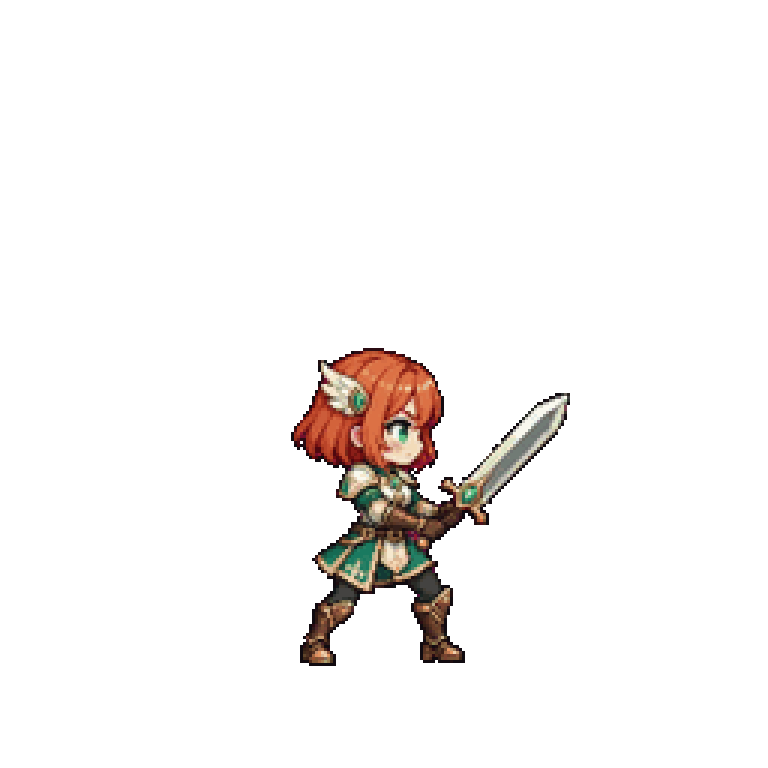
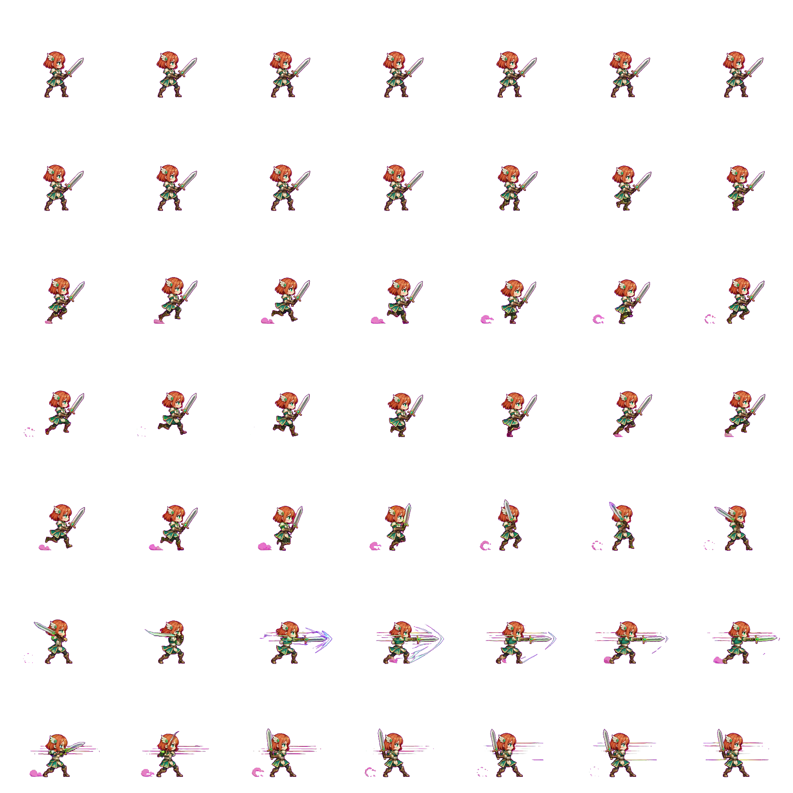

# Example: Chibi Running Dash Attack

**English** | [繁體中文](README.zh-TW.md)



A side-view female chibi knight takes small running steps into a sword thrust, with directional speed trails and a recovery to guard. The transparent animation is **3.23 seconds, 112 frames, 768 × 768**. Motion and effects were generated by Grok; the character was reused from an earlier original-image generation.

## Production

Codex directed the action using [this padded reference](reference.png) and the [complete motion prompt](motion-prompt.txt). The same image was supplied as both the first and last frame to `grok-imagine-video-1.5`. A production-local subclass of the bundled OAuth client added the REST `last_frame` field; this is not a bundled CLI option. The exact image-generator version was not exposed, so this example is not attributed to GPT-Image-2.5.

The [source video](source.mp4) was keyed on magenta with tolerance 0.2 and softness 0.18, sampled onto a 256-pixel-wide raster and enlarged 3× with nearest-neighbor scaling. Fractional-alpha edge colors were approximately unmixed from magenta while preserving alpha. [Phase timing](timing.json) shortened pauses and adjusted action speed. GIF uses a global palette and reserved transparency index; [APNG](final.apng) retains fractional alpha. No local effects, pose warping, reversed playback or crossfade was added.

## Verification and limits

All 112 decoded GIF masks match the source threshold with **zero alpha mismatches**. APNG decoded RGBA matches the exported frames exactly and retains 357,327 fractional-alpha pixel samples across the animation. No opaque foreground pixels touch the canvas edges. These checks establish export integrity, not perfect matting or motion.

The [action contact sheet](contact.jpg) and endpoint poses were inspected. Full-speed playback review has not been completed, so seamlessness and natural cadence are not certified. The sword light is less ornate than the earlier motion reference; this is a delivered revision preview, not a fully validated game asset.

[Download GIF](final.gif) · [Download APNG](final.apng) · [Source video](source.mp4) · [Reference](reference.png) · [Prompt](motion-prompt.txt) · [Verification](verification.json) · [Provenance and hashes](manifest.json)

## Game sprites

[Download sprite pack](sprites.zip) — 112 RGBA frames at 256×256, three sprite-sheet pages and `sprites.json` with frame rectangles and the original 3.23-second timeline. The preview's known 3× enlargement was removed with nearest-neighbor sampling. A shared pivot at (128, 222) marks an approximate initial ground anchor; natural visual displacement remains. No hitboxes, gameplay events, engine importer or root-motion track is included. Every decoded sheet crop matches its frame exactly. Engine validation is still required.



Recreate from the original exported frames and manifest:

```sh
.venv/bin/python scripts/sprite_export.py PATH_TO_DELIVERY/frames \
  --manifest PATH_TO_DELIVERY/manifest.json --out output/dash-sprites \
  --scale-divisor 3 --pivot 128 222
```
