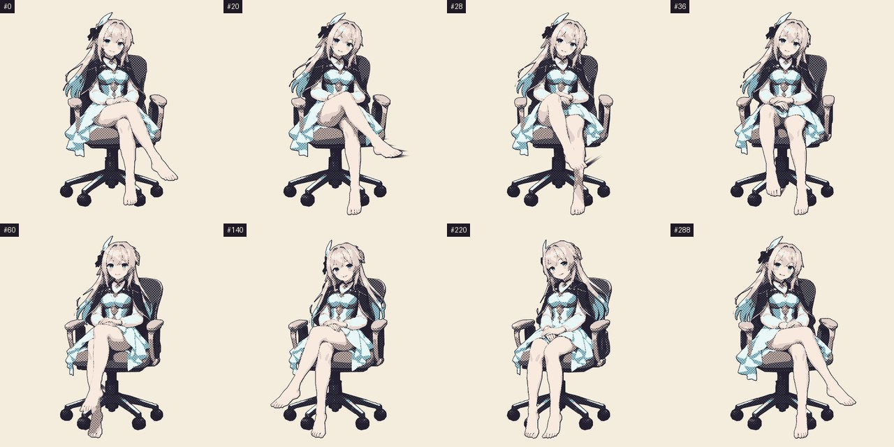

# 範例：材質跟著動作走的風格化重畫

[English](README.md) | **繁體中文**



這裡的 [坐姿換腿 GIF](../seated-leg-switch/README.zh-TW.md) 只當作**動作底稿（plate）**。成品的每個像素都是依據從它量出的 guides 重新畫出來的，沒有任何 plate 像素進入交付物。這個範例完整記錄了 [風格化重畫路線](../../references/stylized-redraw.md)，也包括沒通過的部分。

## 交付物

- [final.mp4](final.mp4)：已驗收的 `manga_action.js` 成品，紙色背景，289 格，沿用 plate 本身的時間軸（9.93 秒）。網點排在沿動作平流的材質座標上，所以會跟著椅子、裙子和披肩移動。速度線依據 plate 實際量到的光流畫出：只在右腿解開交叉時出現，並拖在腳的後方。
- [comparison.mp4](comparison.mp4)：plate、材質座標上的 `ink_hatching`（preview，見下方）和已驗收成品的並排比較。
- [evidence.png](evidence.png)：重新對齊時鐘的量測取捨，以及三個版本的逐項檢查結果。

## 狀態

| 版本 | 自動檢查 | 狀態 |
| --- | --- | --- |
| `manga_action.js`（JS，headless Chromium） | 七項全部通過 | **已驗收** |
| `ink_hatching`，材質在平流座標上 | 動作連貫在 11 次可量測換格中有 2 次被標記 | preview |
| 同樣的排線固定在畫布上（對照組） | 動作連貫 11 次中 10 次被標記 | 對照組：材質在滑動 |

驗收由 Claude 以代理審查者身分、在使用者授權下決定，依據是換腿過程的接觸表和連續畫格。沒有做即時播放。審查紀錄在 [manifest.json](manifest.json)。246 次移動中的換格，只有 11 次有足夠的「混合權重穩定像素」可以評判黏著程度，所以這個時鐘設定下的黏著證據不多。

## 重現

```bash
# plate：從 ../seated-leg-switch/final.gif 取出的編號 RGBA 畫格，加上 durations_ms 時間軸 manifest
.venv/bin/python scripts/extract_guides.py plate --manifest plate.json --out guides --colors 8 --flow
.venv/bin/python scripts/render_stylized.py guides --style examples/stylized-redraw-seated/style-manga.json --out render
.venv/bin/python scripts/qc_redraw.py guides --render render --style examples/stylized-redraw-seated/style-manga.json --out qc.json
```

`manga_action.js` 需要 headless Chromium（`$VGS_CHROME`、Playwright 快取或 PATH）。這支 plate 含光流的 guides 約 750 MB，每個渲染結果約 50 MB。

## 檢查一路上抓到的問題

- **材質黏著，仍可能變形**：單層平流座標通過了早期所有檢查，但第 286 格的排線已扭成大理石般的波紋（形變 1.4）。因此新增了材質扭曲檢查，同樣的退化不會再無聲通過。
- **重新對齊用錯了時鐘**：固定幀數時鐘壓得住扭曲，但 288 格中有 196–209 格在靜止區呼吸；移動距離和應變時鐘又讓扭曲失控（1.26–1.33）。最終版的時鐘依每個點實際量到的材質形變推進，而且只在它移動時推進。
- **靜止判定錯了**：平滑把移動中腿部的光流擴散到旁邊靜止的像素。改成原始或平滑光流任一個判定靜止即算靜止後，剩下的呼吸也消失了：沒有任何靜止像素的圖層權重會改變。
- **黏著檢查分不出交叉淡化和滑動**：現在會排除混合權重有變化的像素，但固定在畫布上的材質照樣會被抓到。

以上都是這一支 plate 的量測結果，不是通用設定。
